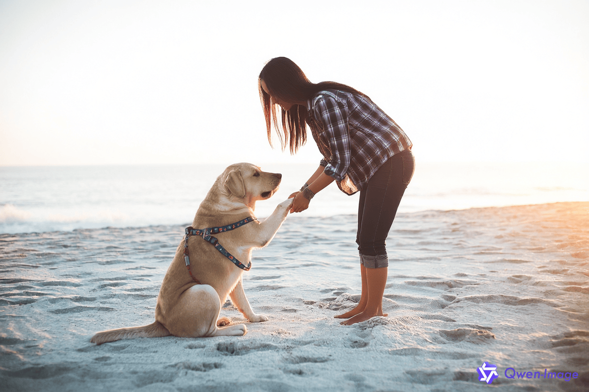

## 图像编辑

最新版本支持 `qwen-image-edit` 模型。介绍可看：[https://huggingface.co/Qwen/Qwen-Image-Edit-2509](https://huggingface.co/Qwen/Qwen-Image-Edit-2509)

默认调用的是国内节点。还有一个新加坡节点，需要设置：

```
DASHSCOPE_API_BASE=https://dashscope-intl.aliyuncs.com/api/v1
```

以编辑这张图片为例：


调用示例

```rust
let request = MultiModalConversationParamBuilder::default()
        .model("qwen-image-edit")
        .input(
            InputBuilder::default()
                .messages(vec![
                    MessageBuilder::default()
                        .role("user")
                        .contents(
                            // vec![
                            //      Element::Image("https://help-static-aliyun-doc.aliyuncs.com/file-manage-files/zh-CN/20241022/emyrja/dog_and_girl.jpeg".into()),
                            //      Element::Text("这是什么?".into())
                            // ]
                            vec![
                                json!({"image": file_path}).try_into()?,
                                json!({"text": "将图中的人物改为站立姿势，弯腰握住狗的前爪?"})
                                    .try_into()?,
                            ],
                        )
                        .build()?,
                ])
                .build()?,
        )
        .parameters(
            ParametersBuilder::default()
                .watermark(true)
                .negative_prompt("低分辨率、错误、最差质量、低质量、残缺、多余的手指、比例不良")
                .seed(14748364)
                .build()?,
        )
        .build()?;

let client = Client::new();

let response = client.multi_modal_conversation().call(request).await?;

for chunk in response.output.choices {
    println!("图片地址: {:?}", chunk.message.content[0].image);
}
```

结果会在响应的 `outputs` 中返回。

```rust
for chunk in response.output.choices {
        println!("图片地址: {:?}", chunk.message.content[0].image);
}
```

结果如下：


